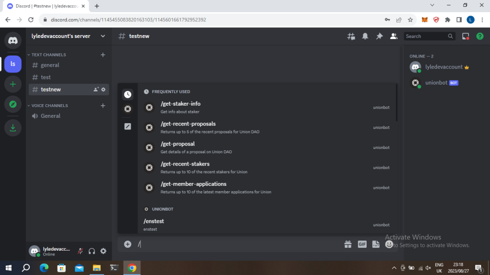
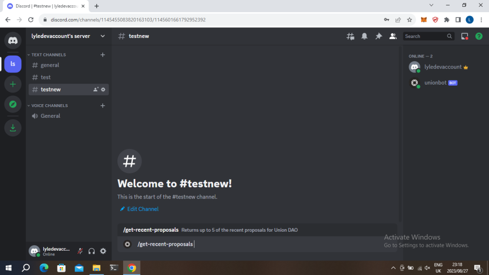
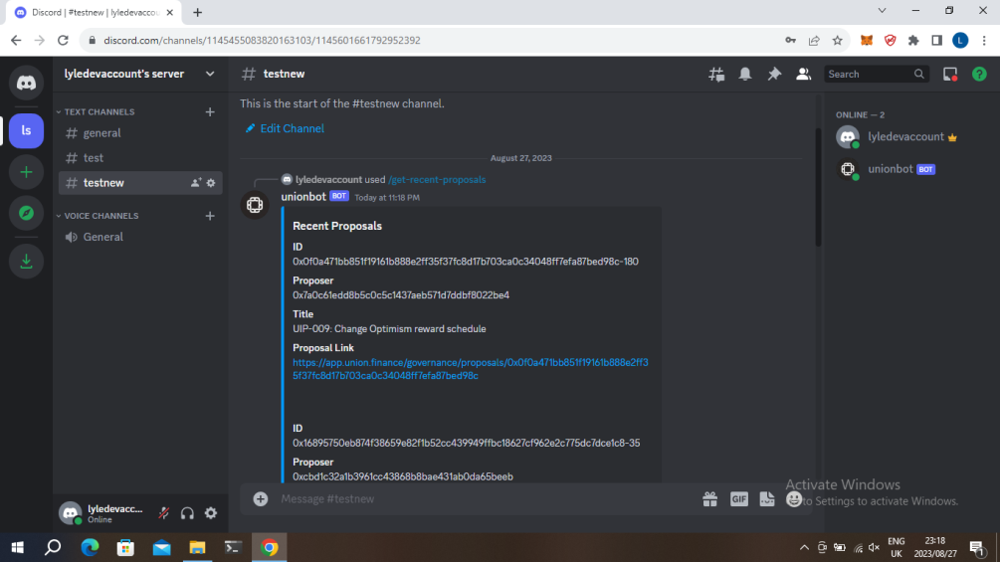
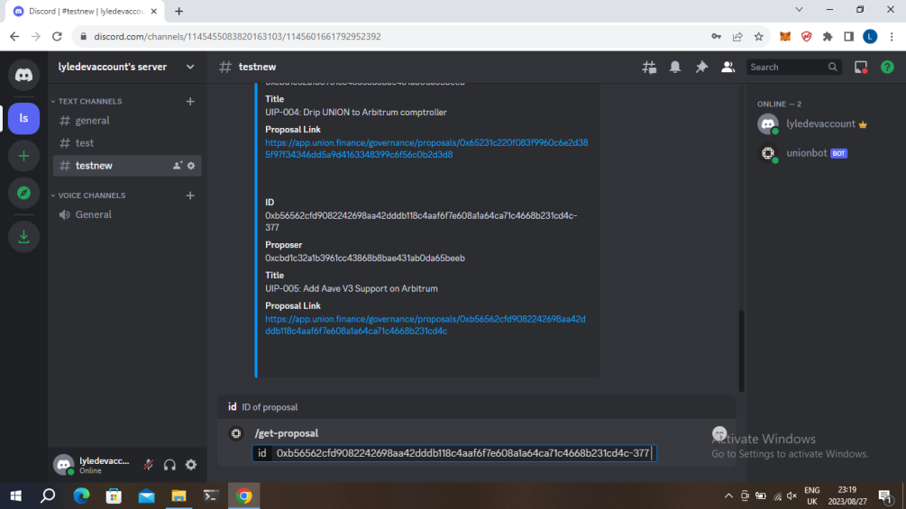
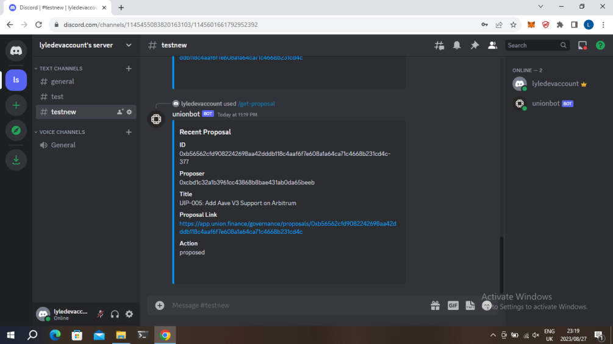
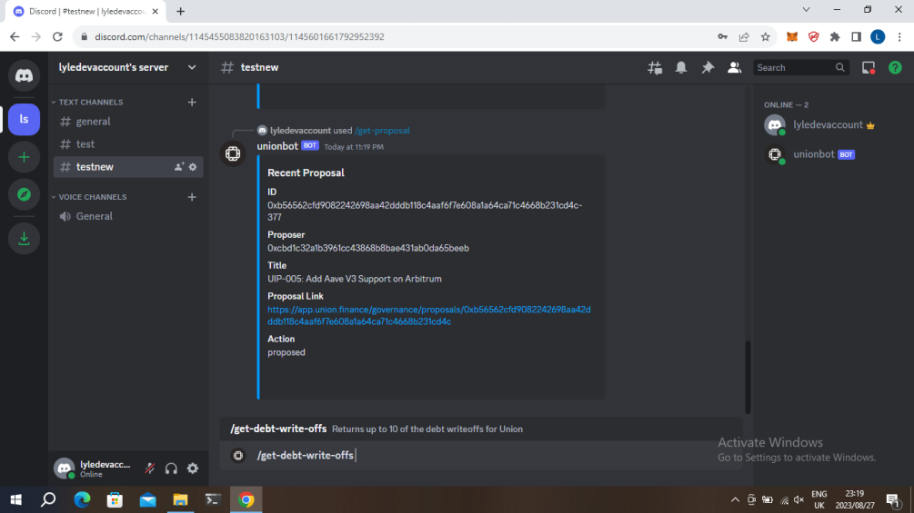
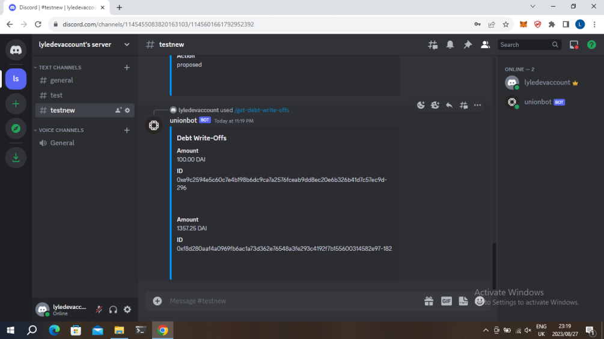
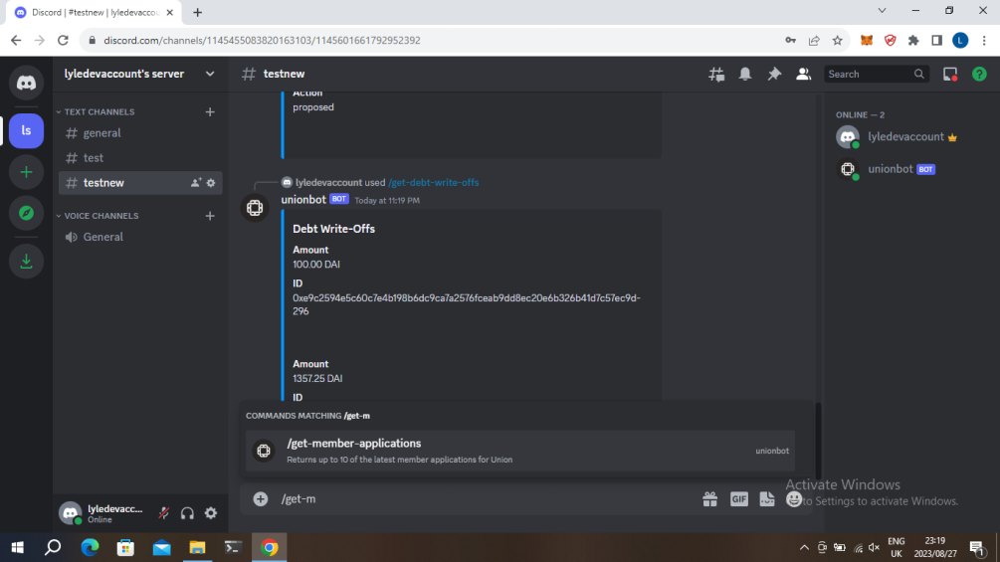

# unionbot
UnionBot is a discord for UnionDAO where users can query about proposals,debt-writeoffs, stakers and more using Discord
 
### Built with
- Graphql, The Graph 
- Nodejs
- Discord.js

### demo

https://www.youtube.com/watch?v=kOBdTAt3qKA

### Screenshots

