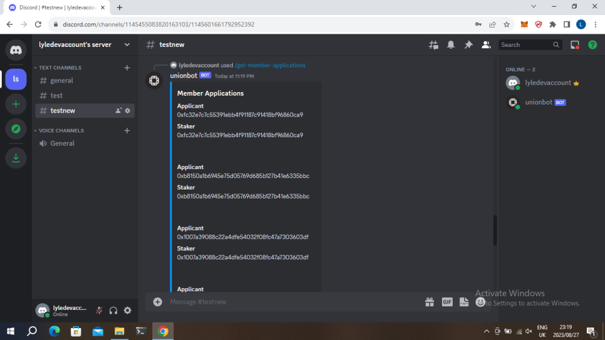

# UnionBot
UnionBot is a discord for UnionDAO where users can query about proposals,debt-writeoffs, stakers and more using Discord
 
### Built with
- Graphql, The Graph 
- Nodejs
- Discord.js

## Commands

## Command: get-recent-proposals

Returns up to 5 of the recent proposals for Union DAO.

## Command: get-proposal

Get details of a proposal on Union DAO.
### parameter

- **Name**: id
- **Description**: ID of the proposal
- **Required**: Yes
- **Type**: String

## Command: get-recent-stakers

Returns up to 10 of the recent stakers for Union.

## Command: get-staker-info

Get info about a staker.
### parameter

- **Name**: id
- **Description**: ID of the staker
- **Required**: Yes
- **Type**: String

## Command: get-debt-write-off

Get info about a debt write-off.
### parameter

- **Name**: id
- **Description**: ID of the debt write-off
- **Required**: Yes
- **Type**: String

## Command: get-debt-write-offs

Returns up to 10 of the debt write-offs for Union.

## Command: get-member-applications

Returns up to 10 of the latest member applications for Union.

### demo

https://www.youtube.com/watch?v=kOBdTAt3qKA

### Screenshots

